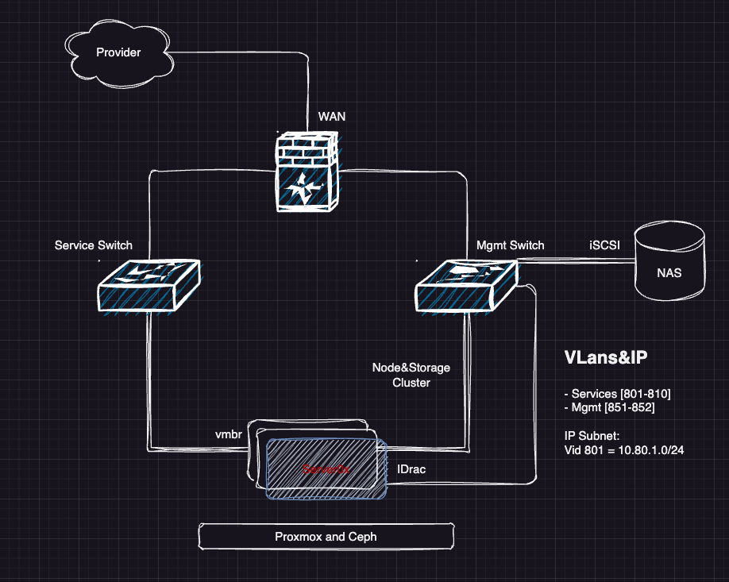
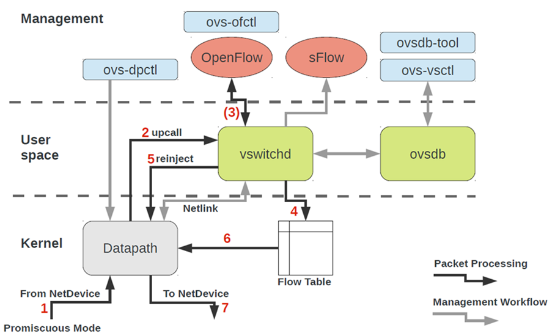
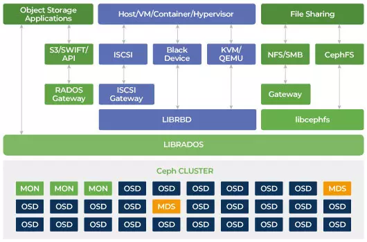

# xOps2024
 CPE camp private cloud [Proxmox](https://www.proxmox.com/en/proxmox-virtual-environment/features)
 - Start Date: 30 Mar 2024
 - End Date: 19 May 2024

 ## Members
 - https://github.com/Supavit072
 - https://github.com/rkrocky007
 - https://github.com/SuchananEve
 - https://github.com/Antkungs
 - https://github.com/l3D2
 - https://github.com/Primwinurachh
 - https://github.com/salywannisa
 - https://github.com/pesatcha
 - https://github.com/PantiraR818
 - https://github.com/Atiwitch15101
 - https://github.com/Chattiporn
 - https://github.com/sirawitnoy
 - https://github.com/dom28s
 - https://github.com/Karritus
 - https://github.com/ta1xf4chs
 - https://github.com/4mGroot
 - https://github.com/Jaruwanngernklom
 - https://github.com/RPTitle2002
 - https://github.com/kititach
 - https://github.com/Jer4yu
 - https://github.com/samatachai
 - https://github.com/prusayon/

## Diagram

- [Current Diagram](https://viewer.diagrams.net/?tags=%7B%7D&highlight=0000ff&edit=_blank&layers=1&nav=1&title=proxmox24.drawio#Uhttps%3A%2F%2Fraw.githubusercontent.com%2Fpitimon%2FxOps2024%2Fmain%2Fmisc%2Fproxmox24.drawio#%7B%22pageId%22%3A%22ztWUro-rzghUD-m8kAbv%22%7D) <<Click here>>

## Lab Equipment
- Fortinet 60E 
  - [datasheet](https://www.firewalls.com/pub/media/wysiwyg/datasheets/Fortinet/FG-FW-60E.pdf)
  - [FortiOS](https://docs.fortinet.com/product/fortigate/hardware)
- Fortiswitch 424D
  - [Specification](https://www.avfirewalls.com.au/FortiSwitch-424D.asp)
- Dell R330
  - [datasheet](https://i.dell.com/sites/csdocuments/Shared-Content_data-Sheets_Documents/en/aa/Dell_PowerEdge_R330_SpecSheet_final.pdf)
- Proxmox
  - [Download](https://www.proxmox.com/en/downloads)
  - [PVE Admin Guide](https://pve.proxmox.com/pve-docs/pve-admin-guide.html) 
  >> 3rd week 
  - [OpenVswitch](https://docs.openvswitch.org/en/latest/intro/what-is-ovs/)
    - 
  
  - [Ceph](https://insujang.github.io/2020-08-30/introduction-to-ceph/)
    - [Architecture](https://docs.ceph.com/en/latest/architecture/)
  

    
## Share
- (https://nextc.ipv9.me/index.php/s/zzmPAB5zzm58axC) expire 31/12/2024 (password in class)