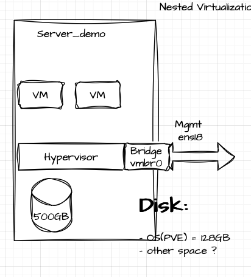
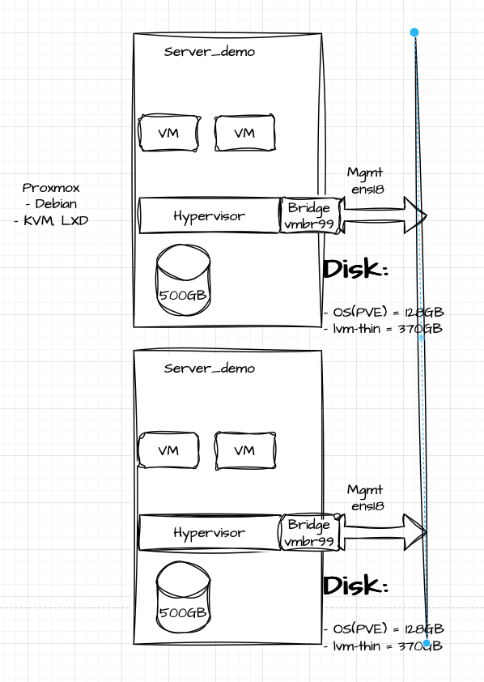

# xOps2024
 CPE camp private cloud [Proxmox](https://www.proxmox.com/en/proxmox-virtual-environment/features)

 ## Members
 - https://github.com/Supavit072
 - https://github.com/rkrocky007
 - https://github.com/SuchananEve
 - https://github.com/Antkungs
 - https://github.com/l3D2
 - https://github.com/Primwinurachh
 - https://github.com/salywannisa
 - https://github.com/pesatcha
 - https://github.com/PantiraR818
 - https://github.com/Atiwitch15101
 - https://github.com/Chattiporn
 - https://github.com/sirawitnoy
 - https://github.com/dom28s
 - https://github.com/Karritus
 - https://github.com/ta1xf4chs
 - https://github.com/4mGroot
 - https://github.com/Jaruwanngernklom
 - https://github.com/kititach
 - https://github.com/Jer4yu
 - https://github.com/samatachai
 - https://github.com/prusayon/

## Diagram

![draw.io](https://viewer.diagrams.net/?tags=%7B%7D&highlight=0000ff&edit=_blank&layers=1&nav=1&title=proxmox24.drawio#R7V1bc%2BK4Ev41VO15CCX5ziPkNlObmUkdzmYmT1OOrYA3xmJtQ2B%2F%2FZF8AVsSd2wMaB4yuCXLsvpTd6u7JbfU29HsMbTHw2%2FYRX5LAe6spd61FEXRAST%2FUco8pViKlhIGoeemJLgk9L1%2FUUYEGXXiuSgqVYwx9mNvXCY6OAiQE5dodhjiz3K1d%2ByXnzq2B4gj9B3b56k%2FPTce5m9hLulfkDcY5k%2BGRictGdl55exNoqHt4s8CSb1vqbchxnH6azS7RT4dvHxc0vseVpQuOhaiIN7mhu4r%2BN%2BXL8rIdE19YH%2B9Gfz1%2BN8bJW1lavuT7IWfQzwlQx5mnY7n%2BUiQ1sigk4seeZMxJTo%2BnpDGe59DL0b9se1Q4ifBAaEN45FPriD5GeJJ4CI3u4o%2BUOwMswtnEk7RgxfHXjDISH97g0HySDJAPd9%2BQ37Pdj4GSSO32MchKQpwQPvx7vl%2BTmop6kP3Xr816SPiEH%2BgQgl4sHrWHb0DB3GBDjXV0Ohz%2BLHMhneKwhjNCqRsbB8RHqE4nJMqeamW8TkDupldfi5RA3MoDAuIsTKanQF1sGh5yUvyI2PnDqyFCs9Cl2A7u8RhPMQDHNj%2B%2FZLK8GpZ5wnjcc4gFMfzbKLakxiXmY1mXvyL%2FAZtPbt6Ta46VnZ5R8cL5BfzwsUzCj3y6ijMaQEZhl%2FFi9dlw%2FRy2VRylbeVw9P3go%2FjAo4DVtdSAOwywHLRuz3x43WwivAkdNAa5umZqLPDAYrX1LPSepSxa0EaIt%2BOvWlZqB0dcjonTTgI5swZzQZUYbQdL3JwO%2Fr0CI9Q1P7EYTL0498pqQyuMfYCgo%2F7KRnPKKO5djRMAAv2kghpSS7aKQTolPeIAniiUHjGkRd7OCBlbziO8ahQoet7A1oQ06nRs7MrBwUJhHt4EhMEkofmiglUKgsrlGxWWbKpikC05Xq%2BKNr0ykSbeimiDV6faDPOUrRB47SQW4DstYTAwyFnbsIcCtwuNaSXWCGUB48OX4rJSwYh1I%2BNwuRWMqD2vFAhUWxRoeVnSliKYENhRLCml239DfX1cn3yI%2B3Bcj4sXmX%2FKWJI7X%2BB2l8HjdP%2BgMNVnaL4YDl8geLU3FKcHl2aHgYkeEogQQmk%2FYFkNApI5t6aDxHGePG87eHo97sXok%2BbPllqvVNrPdUoaz3Y4bWeUac3z9oMsfI4b3DKXqobVlXLjNOsLf2wRlWc65x24WiZZW%2FFASvHgn%2FitVi2cuFIrq5Caylbai2zUVoLalKmbCdTmNCOJlAG9coUKPK0GwmK6Tgk8dB8KIx%2FJjiFt%2FqmAkCXc0uSMaD%2F9xHhVUheN2uD9CltJi0%2BDBV72CfnYSJonRIqFgvl06GCt0O%2FDUYUDf3UncLykbxpXGYWZ9Gxht%2FIc91ERYm4fo6Wns5MbkU0uaGAjWplbORtPTpBPTLSkpPr4lRK4zjZ4Tj5HbuEjYY9StZPyd9%2BjEOahZIJX9eb5oL31p9ElHlLsVwolBgQYEBjVbXIW1krBhbvsMTAz%2B53yTyRRmUCzdDgmWfWyjuF493Xu9B2JPdEU49xmei5kXoy7qkrjeQhLPEvt4dHZAHnBTeJc6tLaoDxLLWSGXuZsbX5hmjBTZQszmk70FrR0PTJDiJGHXx9XmmGL8i0%2F2ViQTHcUDMhNRhI26Cl9ywAbywi9fS7VapE2EhmPNIGdNKAruzSQE56CwX9X38rHQHQn7wFdDHd3fq2F4IGBVikuzPaUb03T%2FoLEs4ACNp5UTsraxPkPdB81OpfaZr2TYel%2FuhtSPsCIc1ooX1NegMeP2l5G%2B6t90UiBZOZ%2FO4njpchET0oOFMxY2hmScyogkRLJZ%2F6RTkDj%2BGb5UXKc4hnIzyj7QaUx7dozJvn0o1CuWLBsoKweAWh6AbPOUU%2FnHG8r%2Bt7t8%2FxaZHZPPc9wrBQ3cytt5S1T28LwoIZP9JoSM7W1FcL9UonXpMYbrILMoEvXmQRHGOibpGKyruiiw70PZOPxU5vUci3tasfnkn%2BqwxDJ83CyubpRhd5AUK6AEI5bbe0LC6PirVpNTapJX3F7K4lOrmGdMg0BJiG0jHgGtojN4t3Ak5H1GLZaDWU%2BS4QKBnp%2BpY2rOYSBRVF0eBjLG14Z6DXv%2B1%2Flfw8xIZkprXIU1gVP2%2FUwd%2FDF1dB4C%2FlH7s3%2B%2Bm%2Fvu8W3QebjZKh7QwnIXqk9DstG8wHe%2BT59I27oUNvd2jGKbizJ%2BT9Er7TSv1cZg%2FjeEzKdboA08nL0T%2B0QtQeYEx4aI%2B9qO3gUVLgREnVh%2Ff0EeRn6SG60is85lLNHcikHhii1AMRrI6SKinEFe9%2FTkN9v100wluIkGOJBnDBEKwQUPpmQHXqFFO5EVPAkw7AI%2B%2BSqGsdJeVcA3a6WgI3fbbf4OhxbzEseTf9SkS%2B%2B2iWrfqKuUiOb0eR5yRDaocxTxbuZwZXBMFdV4X7pDmvBGdxJSmEQO6Y22XdCIFAdi6IB64cF4I5nySq1jaMcivbLh7ZuJioreOtH8VTjHd8%2FuDdZ9JGbbzsVvUylETxcVHSUnU2Be%2BZ%2FTIf0%2FBVhHmvhUSYRNjOCON9wS%2Ff1iBrixCNRFYDkGXqPLJEvuDqgMXveJXAOkNgKcwW19MDa1Uib5YoErxF45YwzwAFEU0fPXG%2BoHT37ANDlYkRmaf2SgsSkb%2BjKCYsVsCLF8YTgpd%2F7WSroMRWs7GlMctRQ2SVqZ06wcX7phepNMJstDv05tnBTglsf1J1TLoHnn7dSaF4lsBlZKIl2mQj8uNUFlLJfYvHzyq986KPcr7jxjTPH%2F0%2Fnl%2Fu%2F9NaJBUq1uP2SYm0BX86uomHXrBoQjXB6iY2TpbdMw%2FltNjLZGXdiwIf%2FCLh8di5VWs9sIV50Qs9V7ivhSakdDpbgmz%2F3EluMVXinYC3TcLhOa2f9M0un1rXT9tk%2F0lPYtNhxeZTdATL8przKRTe4yMTKs5Ha7IJFSJE1ZpQIcju40AkI9dNyWdubHAZQqC1Db2z%2FFducd9A86Z2Kw46K7yLQAadz1KRl%2B1DCLY9QKUywZs3LKPOEmJVQYzf%2BC%2BjgxcBrVMvb1XeBSmRdYbIYuPODUAW78STgeeGILfCwDOHQ4E3udbIs8onBUpn8nU6k4WWXL1C8dC95GX5dC2oOonbpcK94JxzRGH3cG%2FtZjHLLRlsUK5iv4oq%2BlKHDGGvUQoyhF2BoOecmKpgyV5rDDtXPXue1X24dD%2FaV8nyEvE%2Bq%2FWiuSkwXoW9VebKSkxu3D2mHv1bYysEP2dow%2B0k%2F67fi9Jz13ke6MqmzEqNxHRs1%2FqLFznWB6bWsqkYDxijYJqfictph4AKdzqd0ViuD9ZOtfKUercc5DgiQfFm6fQMnE1q4wjqQTPKELYAf1pYZcdri%2BF32JccGqQd1p891SRgnuCkqkZpCFOrR0GYcDeBv3N9tQb9kI%2FVtl4jIJXCpTiNmAOdTr6DS%2BODf8namIWWPCjlyOvVRqGSEYKWAJW1HpSi8eEdicqrQyW7pebUx%2FdofLBHovLqUMmcFWwJjvWuF5V81EeedXZ1sISq2WbikSI3db3I5MM3Ul5eHTA7PDAF2UP1ApM%2FtkIC89qAqYAGSkw%2BcCCBeXXAhDwwtRMDU4ccBs80pHCNAedVH8aGrT2%2BEbIS4RtjE%2Fl3aIuf0VgrBqsOYijMAcGQzLS2anZUCFRNsxTTLLd4rJgG%2B1RlfYyC76ZSR5CC39QmCE%2Bk6gksPgBKJBQRUApw0Hgoo9rnG9W%2BYdwcZEZsuU%2BpOh0ELkUHbfik0lJaq7BTlNeg3TH2ktmXqdbq0ETbfuZpN020q8ZgFEBH26Aw8m0J4vrV6AtdEeiLFesWeUTAOR5u35hjBVTAHLBrMB9e3PccAdOo%2FcB6fcfjqGQuyKXmgpx%2BV6XOBzilCJcivA4RTtYXR5LhdO1eyVkw5DLEdBfRsjoRpMNv2EW0xv8B)

## Lab Equipment
- Fortinet 60E 
  - [datasheet](https://www.firewalls.com/pub/media/wysiwyg/datasheets/Fortinet/FG-FW-60E.pdf)
  - [FortiOS](https://docs.fortinet.com/product/fortigate/hardware)
- Fortiswitch 424D
  - [Specification](https://www.avfirewalls.com.au/FortiSwitch-424D.asp)
- Dell R330
  - [datasheet](https://i.dell.com/sites/csdocuments/Shared-Content_data-Sheets_Documents/en/aa/Dell_PowerEdge_R330_SpecSheet_final.pdf)
- Proxmox
  - [Download](https://www.proxmox.com/en/downloads)
  - [PVE Admin Guide](https://pve.proxmox.com/pve-docs/pve-admin-guide.html)  
## Share
- (https://nextc.ipv9.me/index.php/s/zzmPAB5zzm58axC) expire 31/12/2024 (password in class)